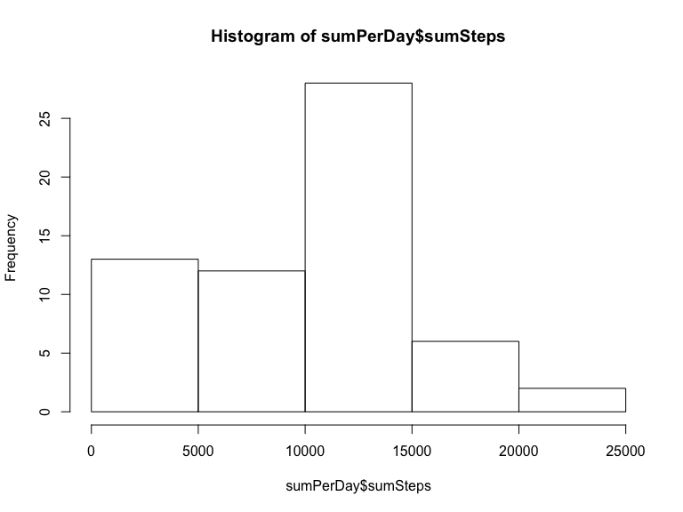
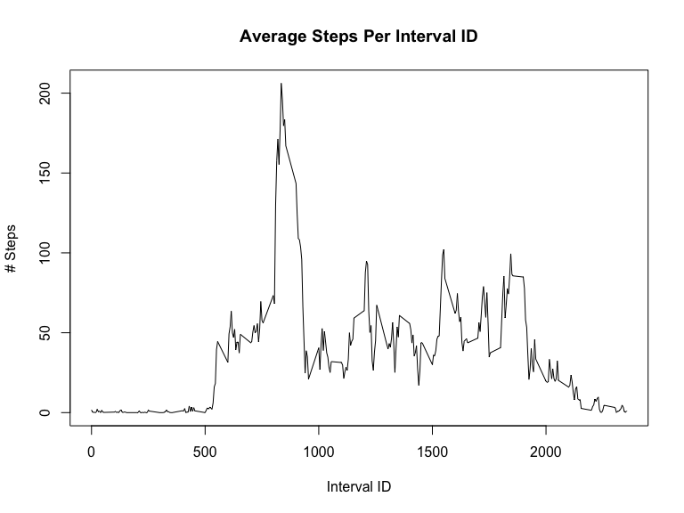
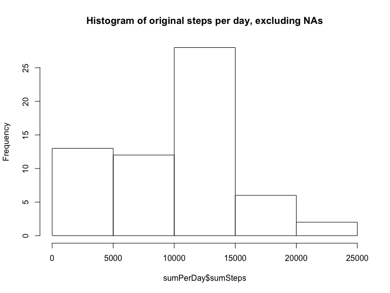
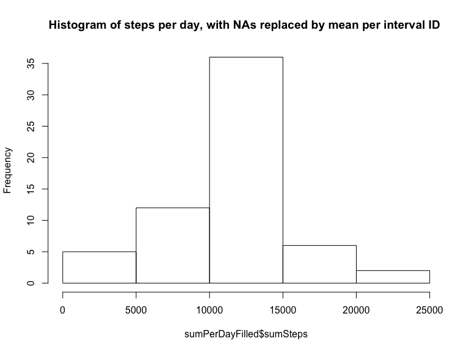
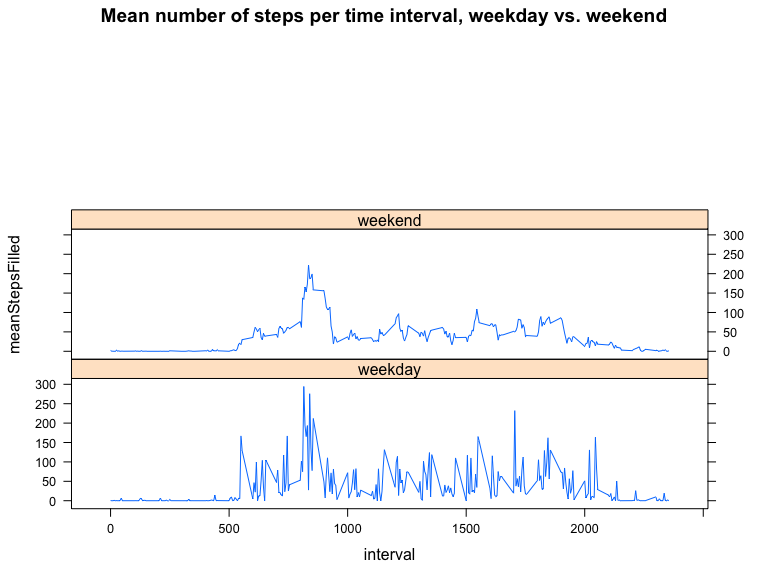

# Reproducible Research: Peer Assessment 1


## Loading and preprocessing the data
Loading the data:

```r
library(dplyr)
```

```
## 
## Attaching package: 'dplyr'
## 
## The following objects are masked from 'package:stats':
## 
##     filter, lag
## 
## The following objects are masked from 'package:base':
## 
##     intersect, setdiff, setequal, union
```

```r
knitr::opts_chunk$set(fig.width=8, fig.height=6, fig.path='figures/',
                      echo=TRUE, warning=FALSE, message=FALSE)


projectLocation = '/Users/JKG/Documents/00_coursera/reproresearch/project1'
setwd(projectLocation)
fileName = 'activity.csv'
fullFilePath = paste(projectLocation, "/", fileName, sep='')
data = read.csv(fullFilePath)
# print names to show that data has loaded
print (names(data))
```

```
## [1] "steps"    "date"     "interval"
```


## What is mean total number of steps taken per day?

```r
# get the total number of steps per day
sumPerDay = summarise(group_by(data, date),
          sumSteps = sum(steps, na.rm = TRUE))
#show histogram of steps per day
hist(sumPerDay$sumSteps)
```

 


```r
#get the mean total number of steps per day
mean(sumPerDay$sumSteps)
```

```
## [1] 9354.23
```


```r
#also show the median # of steps per day
median(sumPerDay$sumSteps)
```

```
## [1] 10395
```


## What is the average daily activity pattern?

```r
#now we'll aggregate by interval ID
meanPerIntervalID = summarise(group_by(data, interval),
          meanSteps = mean(steps, na.rm = TRUE))
#show line chart of # of steps per Interval ID
with(meanPerIntervalID, plot(interval, meanSteps, main = "Average Steps Per Interval ID", xlab = 'Interval ID', ylab = "# Steps", type = "n"))
lines(meanPerIntervalID$interval, meanPerIntervalID$meanSteps)
```

 


```r
#find the Interval ID with the highest number of mean steps
meanPerIntervalID[which.max(meanPerIntervalID$meanSteps),]
```

```
## Source: local data frame [1 x 2]
## 
##   interval meanSteps
## 1      835  206.1698
```

## Inputing missing values

1. Calculate and report the total number of missing values in the dataset (i.e. the total number of rows with NAs)

```r
# here are the number of frows with NAs in the steps field
naRows = subset(data, is.na(steps))
nrow(naRows)
```

```
## [1] 2304
```

2. Devise a strategy for filling in all of the missing values in the dataset. The strategy does not need to be sophisticated. For example, you could use the mean/median for that day, or the mean for that 5-minute interval, etc.


```r
# I'll fill in values with the mean value for each particular interval
```

3. Create a new dataset that is equal to the original dataset but with the missing data filled in.

```r
# Below I fill in values with the mean value for each particular interval
merged <- merge(data,meanPerIntervalID,by='interval')
merged = mutate(merged, stepsFilled = ifelse(is.na(steps), meanSteps, steps))
# note how the first value for steps is NA, but in the column "stepsFilled" it now has the mean value, the rest are the normal reported values
head(merged)
```

```
##   interval steps       date meanSteps stepsFilled
## 1        0    NA 2012-10-01  1.716981    1.716981
## 2        0     0 2012-11-23  1.716981    0.000000
## 3        0     0 2012-10-28  1.716981    0.000000
## 4        0     0 2012-11-06  1.716981    0.000000
## 5        0     0 2012-11-24  1.716981    0.000000
## 6        0     0 2012-11-15  1.716981    0.000000
```

4. Make a histogram of the total number of steps taken each day and Calculate and report the mean and median total number of steps taken per day. Do these values differ from the estimates from the first part of the assignment? What is the impact of imputing missing data on the estimates of the total daily number of steps?


```r
# for reference, here's the original steps per day, excluding NAs completely 
hist(sumPerDay$sumSteps, main= 'Histogram of original steps per day, excluding NAs')
```

 


```r
# now let's do the histogram of NAs replaced with means for respective interval IDs
# get the total number of steps per day, with the filled NAs
sumPerDayFilled = summarise(group_by(merged, date),
          sumSteps = sum(stepsFilled, na.rm = TRUE))
#show histogram of steps per day
hist(sumPerDayFilled$sumSteps, main = 'Histogram of steps per day, with NAs replaced by mean per interval ID ')
```

 

```r
# as seen above, this new data set is more normally distributed, many fewer days with < 5,000 steps 
```

Do these values differ from the estimates from the first part of the assignment? 


```r
# now let's look at the means and medians for comparison.
#again let's get the original mean total number of steps per day (original, NAs excluded)
mean(sumPerDay$sumSteps)
```

```
## [1] 9354.23
```


```r
#get the new, derived mean total number of steps per day (NAs replaced with means)
mean(sumPerDayFilled$sumSteps)
```

```
## [1] 10766.19
```

```r
# we can see that the mean of the data with replaced NAs is now higher by 1,300 steps
```


```r
#and here is the new, derived median # of steps per day (original, NAs excluded)
median(sumPerDay$sumSteps)
```

```
## [1] 10395
```


```r
#also show the median # of steps per day (NAs replaced with means)
median(sumPerDayFilled$sumSteps)
```

```
## [1] 10766.19
```

```r
# we can see that the median of the data with replaced NAs is now higher by over 300 steps
# both mean and median per day are higher when replacing any interval's NA value with that interval's mean
```

What is the impact of imputing missing data on the estimates of the total daily number of steps?

```r
#original total # of steps
sum(data$steps, na.rm = TRUE)
```

```
## [1] 570608
```

```r
#new, derived/ filled in total # of steps
sum(merged$stepsFilled, na.rm = TRUE)
```

```
## [1] 656737.5
```

```r
# the difference between filled-in and original is
sum(merged$stepsFilled, na.rm = TRUE) - sum(data$steps, na.rm = TRUE)
```

```
## [1] 86129.51
```

```r
# the overall # of steps is greater by over 86,000 steps when filling in NAs with means for each interval
```


## Are there differences in activity patterns between weekdays and weekends?
For this part the weekdays() function may be of some help here. Use the dataset with the filled-in missing values for this part.

1. Create a new factor variable in the dataset with two levels – “weekday” and “weekend” indicating whether a given date is a weekday or weekend day.


```r
# convert date (factor) into date class with as.Date
merged = mutate(merged, dateAsDate = as.Date(date, format = "%Y-%m-%d"))
# create column which tells which day of the week each date is
merged = mutate(merged, dayOfWeek = weekdays(dateAsDate, abbr = TRUE))
# create factor to simplify the day of the week into either weekday or weekend
merged = mutate(merged, weekdayOrWeekend = ifelse(dayOfWeek == c('Mon','Tue','Wed','Thu','Fri','Sat','Sun'), 'weekday', 'weekend'))
merged$weekdayOrWeekend = factor(merged$weekdayOrWeekend)
head(merged)
```

```
##   interval steps       date meanSteps stepsFilled dateAsDate dayOfWeek
## 1        0    NA 2012-10-01  1.716981    1.716981 2012-10-01       Mon
## 2        0     0 2012-11-23  1.716981    0.000000 2012-11-23       Fri
## 3        0     0 2012-10-28  1.716981    0.000000 2012-10-28       Sun
## 4        0     0 2012-11-06  1.716981    0.000000 2012-11-06       Tue
## 5        0     0 2012-11-24  1.716981    0.000000 2012-11-24       Sat
## 6        0     0 2012-11-15  1.716981    0.000000 2012-11-15       Thu
##   weekdayOrWeekend
## 1          weekday
## 2          weekend
## 3          weekend
## 4          weekend
## 5          weekend
## 6          weekend
```
2. Make a panel plot containing a time series plot (i.e. type = "l") of the 5-minute interval (x-axis) and the average number of steps taken, averaged across all weekday days or weekend days (y-axis). See the README file in the GitHub repository to see an example of what this plot should look like using simulated data.

```r
#now we'll aggregate by interval ID and weekdayOrWeekend
meanPerIntervalIDNew = summarise(group_by(merged, interval, weekdayOrWeekend),
                                 meanStepsFilled = mean(stepsFilled, na.rm = TRUE))

# draw the plot, splitting weekdays and weekends
library(lattice) 
xyplot(meanStepsFilled~interval|weekdayOrWeekend,
        data=meanPerIntervalIDNew,
        type = 'l',
       layout=c(1,3),
        main="Mean number of steps per time interval, weekday vs. weekend")
```

 

```r
#notice that both weekends and weekdays see the main spike of steps around interval 800.  On the weekday chart there is a higher peak (around 294), and the weekday shows more interval-to-interval variance.
```


